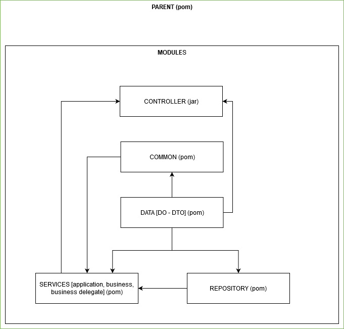

# <span style="color:#313E50">SIMPLE QUARKUS PROJECT</span>
## Get started
*Requirements:* **maven 3.6.3** and **java 11**   
Clone or download the project then run the following commands. Hit **Enter** after each command line

```
mvn clean install
mvn clean compile quarkus:dev -Ddebug or mvn quarkus:dev
```   
Running the project with specific profile. If not precise, *prod* profile will be activated by default
```
mvn clean install
QUARKUS_PROFILE=dev java -jar controller/target/mcs-quarkus-poc-1.0-SNAPSHOT-runner.jar
```

# Build your own
## Create a clean architecture
The basic concept is to use the same way we do to build a multi-module maven project. So, to be more specific, we need to create a maven based-module project then change the runner as *Quarkus* instead of *Maven*.  

## Structure (Our Goal)
- Parent POM
	- [Module 1] controller (*starter*)
		- [Dependency] Common
		- [Dependency] services
		- [Dependency] data
	- [Module 2] services
		- [Dependency] data
		- [Dependency] common
		- [Dependency] repository
	- [Module 3] repository
		- [Dependency] data
	- [Module 4] common
		- [Dependency] data


### Create Parent (**Parent POM**)
Let's create a parent to hold our modules by using the command line below
```
mvn archetype:generate -DgroupId=group.id -DartifactId=mcs_quarkus_poc
```

### Set Parent as Parent
Modify the *pom.xml* file and add this

```xml
<packaging>pom</packaging>
```

### Add modules
Adding modules should be done by executing the following command lines one after the other
```
mvn archetype:generate -DgroupId=group.id  -DartifactId=controller  
mvn archetype:generate -DgroupId=group.id  -DartifactId=services  
mvn archetype:generate -DgroupId=group.id  -DartifactId=repository  
mvn archetype:generate -DgroupId=group.id  -DartifactId=data  
mvn archetype:generate -DgroupId=group.id  -DartifactId=common  
```

### Add dependency between modules
Add the following xml code to the module to add the dependency (Refer to the structure above)
```xml
<dependency>
	<groupId>${group_id}</groupId>
	<artifactId>${artifact_id}</artifactId>
	<version>${pom.version}</version>
	<type>jar</type>
	<scope>compile</scope>
</dependency>
```

## Run the maven project as Quarkus project
### Modification Parent POM
Modify the parent pom.xml as follows
```xml
<properties>
    <project.build.sourceEncoding>UTF-8</project.build.sourceEncoding>
    <quarkus-plugin.version>1.8.1.Final</quarkus-plugin.version>
    <quarkus.platform.artifact-id>quarkus-universe-bom</quarkus.platform.artifact-id>
    <quarkus.platform.group-id>io.quarkus</quarkus.platform.group-id>
    <quarkus.platform.version>1.8.1.Final</quarkus.platform.version>
</properties>
....
<dependencyManagement>
    <dependencies>
      <dependency>
        <groupId>${quarkus.platform.group-id}</groupId>
        <artifactId>${quarkus.platform.artifact-id}</artifactId>
        <version>${quarkus.platform.version}</version>
        <type>pom</type>
        <scope>import</scope>
      </dependency>
    </dependencies>
</dependencyManagement>
....
<build>
  <plugins>
    <plugin>
      <groupId>io.quarkus</groupId>
      <artifactId>quarkus-maven-plugin</artifactId>
      <version>${quarkus-plugin.version}</version>
    </plugin>
  </plugins>
</build>
```

### Modification main module (starter)
Change the controller pom.xml file as follows
```xml
<properties>
    <quarkus-plugin.version>1.8.1.Final</quarkus-plugin.version>
 </properties>
...
<build>
  <plugins>
    <plugin>
      <groupId>io.quarkus</groupId>
      <artifactId>quarkus-maven-plugin</artifactId>
      <version>${quarkus-plugin.version}</version>
      <executions>
        <execution>
          <goals>
            <goal>generate-code</goal>
            <goal>build</goal>
          </goals>
        </execution>
      </executions>
    </plugin>
  </plugins>
</build>
```

And for the others (common, data, repository and services modules) like this one
```
<build>
    <plugins>
        <plugin>
            <artifactId>maven-compiler-plugin</artifactId>
            <version>3.6.1</version>
            <configuration>
                <release>11</release>
            </configuration>
        </plugin>
    </plugins>
</build>
``` 

## Generate configuration file
*application.properties file should be placed under the main module*  
So, in our case, right click on the main module (*controller*) and open a terminal to execute the command below. 
```
mvn io.quarkus:quarkus-maven-plugin:1.8.1.Final:generate-config -Dfile=application.properties
```

All Quarkus configurations should be placed in it.

## Set host and port in application.properties
```
quarkus.http.host=localhost
quarkus.http.port=8080
```

## Custom profile
By default we have **dev** and **prod** profile; and for each profile we can set different configuration
```
%dev.quarkus.http.host=dev_server_host
%prod.quarkus.http.host=prod_server_host
```
So, how about a custom profile?   
Don't worry, Quarkus made our life easier   
All we have to do is to create a profile by putting **%{profile}** as a prefix of an Quarkus configuration.   
Let's say that we want to add a profile named *staging* on the project, so we put the following configuration to the application.properties and that's all.
```
%staging.quarkus.http.host=staging_server_host
```
Running the custom profile should be executed using the command line below
```
QUARKUS_PROFILE=staging java -jar controller/target/mcs-quarkus-poc-1.0-SNAPSHOT-runner.jar
```
## Add extension
```
mvn quarkus:add-extension -Dextensions="extension_comma_separated_list"
mvn quarkus:add-extension -Dextensions="resteasy, resteasy-jackson"
```